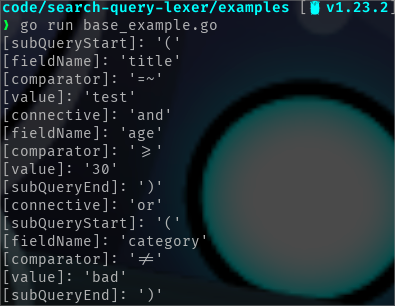
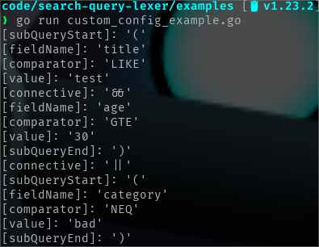
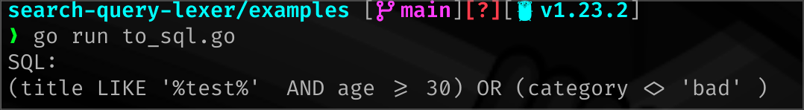

# Search Query Lexer

Search Query Lexer is a Go component to tokenize search query strings like one might find on a web application. It provides a method to convert a string into a set of tokens that can then be parsed into whatever format or outcome you desire. It allows you to define valid fields, connectives, and comparators. Here is an example of usage.

```go
package main

import (
	"fmt"
	"os"

	searchquerylexer "github.com/adampresley/search-query-lexer"
)

func main() {
	config := searchquerylexer.Config{
		ComparatorConfig: searchquerylexer.DefaultComparatorConfig,
		ConnectiveConfig: searchquerylexer.DefaultConnectiveConfig,
		FieldNames: []string{
			"title",
			"age",
			"category",
		},
	}

	lexer, err := searchquerylexer.NewLexer(config)

	if err != nil {
		fmt.Printf("error initializing lexer: %s\n", err.Error())
		os.Exit(1)
	}

	input := `(title=~"test" AND age >= 30) OR (category != "bad")`

	tokens, err := lexer.Tokenize(input)

	if err != nil {
		fmt.Printf("%s\n", err.Error())
		os.Exit(1)
	}

	for _, t := range tokens {
		fmt.Printf("%s\n", t.String())
	}
}
```

This will produce output that looks like this.



By default, the following is what defaults are used for connectives and comparators:

- Comparators: `=,!=,>,<,>=,<=,=~,!~`
- Connectives: `AND,OR`

If you don't want to use the defaults, you can configuration your own. Here is an example.

```go
package main

import (
	"fmt"
	"os"

	searchquerylexer "github.com/adampresley/search-query-lexer"
)

func main() {
	config := searchquerylexer.Config{
		ComparatorConfig: searchquerylexer.ComparatorConfig{
			Equal:              "EQ",
			NotEqual:           "NEQ",
			LessThan:           "LT",
			GreaterThan:        "GT",
			LessThanEqualTo:    "LTE",
			GreaterThanEqualTo: "GTE",
			Like:               "LIKE",
			NotLike:            "!LIKE",
		},
		ConnectiveConfig: searchquerylexer.ConnectiveConfig{
			And: "&&",
			Or:  "||",
		},
		FieldNames: []string{
			"title",
			"age",
			"category",
		},
	}

	lexer, err := searchquerylexer.NewLexer(config)

	if err != nil {
		fmt.Printf("error initializing lexer: %s\n", err.Error())
		os.Exit(1)
	}

	input := `(title LIKE "test" && age GTE 30) || (category NEQ "bad")`

	tokens, err := lexer.Tokenize(input)

	if err != nil {
		fmt.Printf("%s\n", err.Error())
		os.Exit(1)
	}

	for _, t := range tokens {
		fmt.Printf("%s\n", t.String())
	}
}
```

This would product similar output.



Once you have token output you can parse it to do whatever you want with it. For example, you can turn the output to SQL or some other format. Here is a trivial, non-production ready example of turning an input into a SQL where clause.

```go
package main

import (
	"fmt"
	"os"
	"strconv"
	"strings"

	searchquerylexer "github.com/adampresley/search-query-lexer"
)

func main() {
	config := searchquerylexer.Config{
		ComparatorConfig: searchquerylexer.DefaultComparatorConfig,
		ConnectiveConfig: searchquerylexer.DefaultConnectiveConfig,
		FieldNames: []string{
			"title",
			"age",
			"category",
		},
	}

	lexer, err := searchquerylexer.NewLexer(config)

	if err != nil {
		fmt.Printf("error initializing lexer: %s\n", err.Error())
		os.Exit(1)
	}

	input := `(title=~"test" AND age >= 30) OR (category != "bad")`

	tokens, err := lexer.Tokenize(input)

	if err != nil {
		fmt.Printf("%s\n", err.Error())
		os.Exit(1)
	}

	result := strings.Builder{}
	inLike := false

	for _, t := range tokens {
		switch t.Type {
		case searchquerylexer.TokenTypeComparator:
			switch t.Value {
			case "!=":
				result.WriteString(" <> ")

			case "=~":
				inLike = true
				result.WriteString(" LIKE '%")

			case "!~":
				inLike = true
				result.WriteString(" NOT LIKE '%")

			default:
				result.WriteString(" " + t.Value + " ")
			}

		case searchquerylexer.TokenTypeValue:
			if inLike {
				result.WriteString(t.Value + "%' ")
				inLike = false
			} else {
				// Is this a number?
				if _, err := strconv.Atoi(t.Value); err == nil {
					result.WriteString(t.Value)
				} else {
					result.WriteString("'" + t.Value + "' ")
				}
			}

		case searchquerylexer.TokenTypeConnective:
			result.WriteString(" " + strings.ToUpper(t.Value) + " ")

		default:
			result.WriteString(t.Value)
		}
	}

	fmt.Printf("SQL:\n%s\n", result.String())
}
```

This produces output that looks like this.


